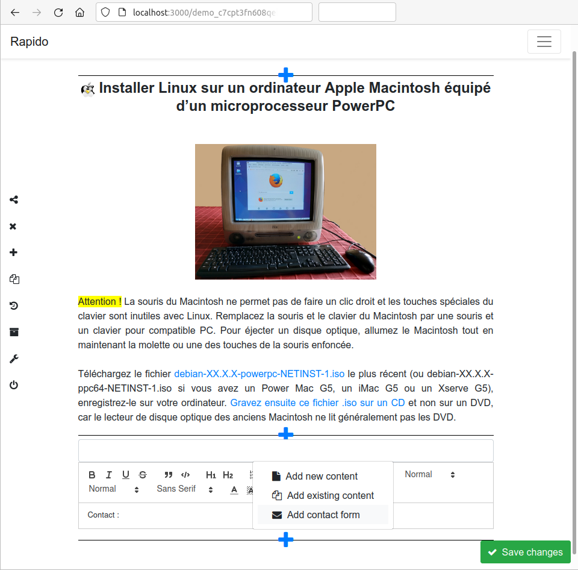

# Create your website with Rapido. Edit, publish and share collaborative content.

# Features

- Create webpages and edit them with [Quill](https://quilljs.com) WYSIWYG editor;
- Duplicate a page;
- Add a menu with links to local pages or remote URLs. Menu items can be reordered by drag and drop;
- Save a page at different times, view the page history and revert to a previous version;
- Share a page by email;
- Invite other people to become coauthors of your pages;
- With the file manager, add an image or a video to multiple pages;
- Insert contact forms in pages to allow people to contact you.

# Highlights

- Rapido is very fast;
- Rapido is very easy to use;
- Rapido does not use any external resources such as APIs, fonts and other tracking tools.

&nbsp;&nbsp;&nbsp;&nbsp;

# Contribute

To report a bug, translate Rapido or improve code and documentation, see [CONTRIBUTING.md](CONTRIBUTING.md).

&nbsp;&nbsp;&nbsp;&nbsp;

# Donate, sponsor

<table>
  <tr>
    <td colspan="2">To donate using crypto-currencies, use these deposit addresses (ask for other crypto-currencies):</td>
  </tr>
  <tr>
    <td colspan="2" style="text-align: center;"> Cardano: DdzFFzCqrht6d5xQRwLCaXUNsyaw6rC5jrATKcpdRPquRuZkdMM7JXytRD7KRae3WH4VFVtw62mjCCk11co2p5dK9viS44f517Mm8yS7</td>
  </tr>
  <tr>
    <td style="text-align: center;"> Solana: FL31xswJ63Xzaji6ENum4wV92hwq35wAQjUykWohkGbP</td><td style="text-align: center;"> Ethereum and ERC-20 tokens: 0x2f8d62ca83e38e8592a7e04e9638d804de1cb2bc Transfer between Kraken accounts is impossible. If you are using a Kraken account, you need to transfer the funds from your Kraken account to an external wallet first. After that you would be able to transfer the funds to our Kraken account.</td>
  </tr>
</table>

Send an email to [david.vantyghem@laposte.net](mailto:david.vantyghem@laposte.net) with your name, website... I will add you to the list of donors.

# Authors and license

[David VANTYGHEM](mailto:david.vantyghem@laposte.net), [Azzam A.I](mailto:azzamai91@gmail.com), [Widiyaksa A](mailto:widiyaksa@gmail.com), [Louis LAUGIER](mailto:l.laugier@protonmail.com), [F PORTIER](mailto:f.portierdev@protonmail.com), Jacky FRANCOIS (english translation).\
**Rapido** is a complete rewrite of razorCMS from [Paul SMITH](https://github.com/smiffy6969).

**Rapido** is [Free and Open Source Software](https://gnu.org/philosophy/free-sw.html). You can redistribute it and/or modify it under the terms of the [GNU Affero General Public License](COPYING).
